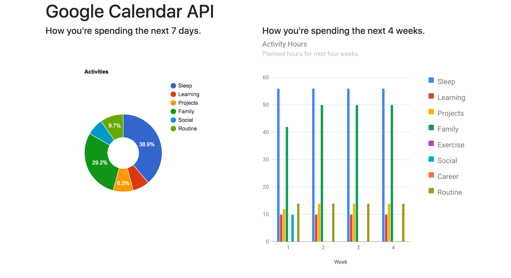

# google-calendar
Google Calendar App to view how you're planning to spend your time over the next week and several weeks. Can't manage what you can't track!

## Screenshots


## Getting Started
These instructions will get you a copy of the project up and running on your local machine for development and testing purposes.

### Prerequisites
* Python3.6+
* pip3

### Setup and Installation
You first need to go to [go get your Google Calendar API credentials](https://developers.google.com/calendar/quickstart/python) and press the "ENABLE THE GOOGLE CALENDAR API". You will get a pop-uo for your credentials that you will need to download and move to the project root folder google-calendar. After your can copy and paste the following.
```
git clone https://github.com/itzliu/google-calendar.git      # Clone repository.
cd google-calendar
python3 -m venv venv
source venv/bin/activate
pip install -r requirements.txt
python run.py
```

## Built With
* Flask Framework
* Google Calendar API
* Google Charts API

## What I Learned
* How to use Google Calendar API.
* How to create charts using Google Charts API.
* How to use Python datetime objects.

## Authors
* Harry Liu

## Acknowledgements
* [https://github.com/KalleHallden/Calendar_Automator](https://github.com/KalleHallden/Calendar_Automator)
